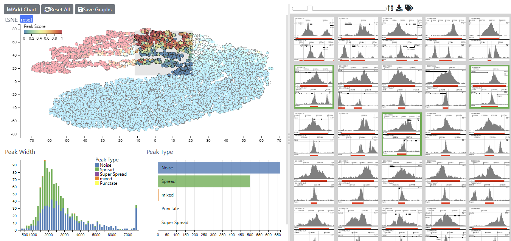

# CIView

CiView is a way of looking a multi-variate data and quickly visualizing the effect that each parameter has on the dataset as a whole. Able to to work with upto a millionIt allows homing in and visualizing smaller subsets and ‘tagging’ data in these subsets.
* Users can add any graphs based on the supplied data.
* Capabale if handling upto a million data points
* based upon dc charts, which in turn used d3 (https://d3js.org/) and crossfilter(https://square.github.io/crossfilter/)
* The default scatter plots have been replaced with those using webgl technology 
* Graphs can be linked to a table (slickgrid - https://github.com/mleibman/SlickGrid) capable of displaying millions rows and having the ability to edit the data. 
* Also includes an Image table capable of dynamically displaying millions of images

